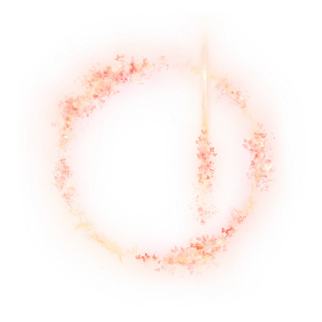

  <h3>Hi, I am Rafael Borges</h3>

  **About Me**

 Backend Software Engineer in training, pursuing a degree in Systems Analysis and Development at UNICID. 
 Currently working as a Software Engineer Intern at Epadoca, focused on .NET Core. 
  Focused on enhancing my knowledge in Systems Architecture, DevOps, and Databases management and integration, while maintaining my interest in AI/ML.  
   

 
 
 

 

  
  

 
 
 
 

  <h3>Tech Stack </h3>
   
  

 

  <h3>Contact me </h3>
   
  

    
    &nbsp;
    
  

